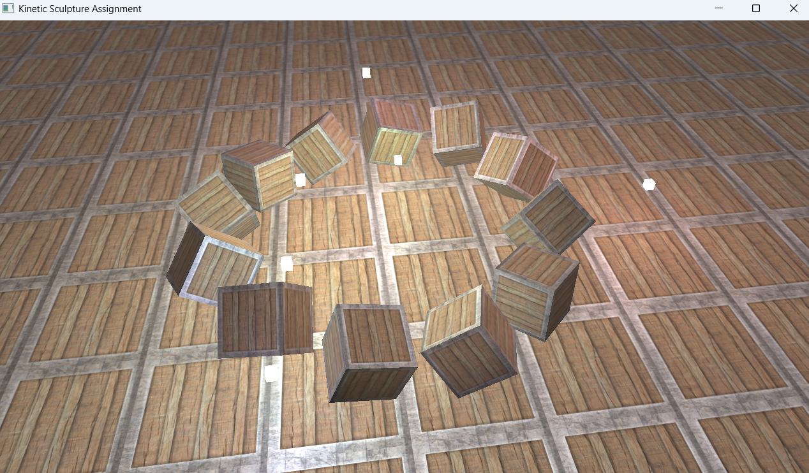
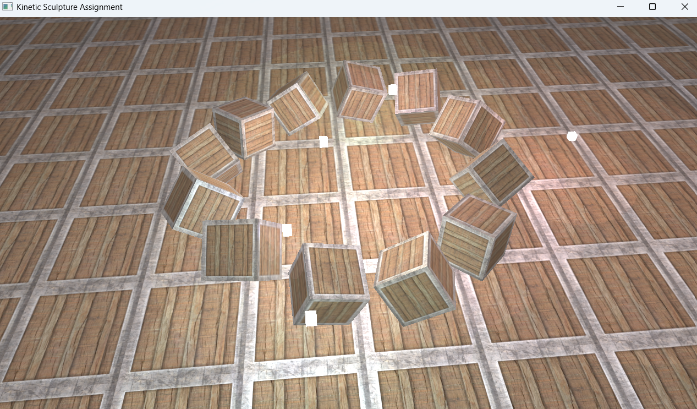
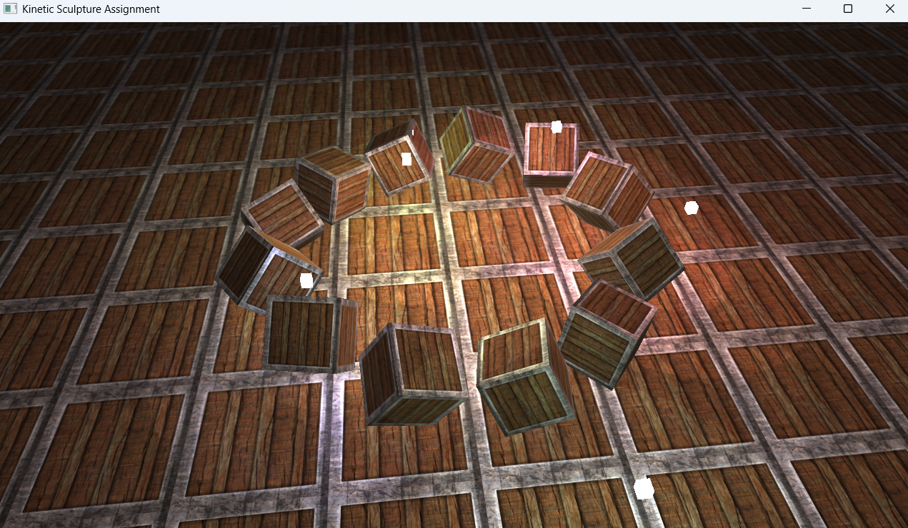

\# Multiple Lights with Animations 

This project demonstrates multiple light sources, spotlight control, and kinetic sculpture style animations using OpenGL.  

It is part of the assignment submission.

\## Screenshots

&nbsp; 

&nbsp; 

&nbsp; 

\## Demo Videos

\[!\[Watch the video](screenshots/shot1.png)](videos/video1.mp4)

\## How to Run

\- Compile `src/multiple\_lights.cpp` with the shader files:

&nbsp; - `6.multiple\_lights.vs`, `6.multiple\_lights.fs`

&nbsp; - `6.light\_cube.vs`, `6.light\_cube.fs`

\- Place textures in `resources/textures/`

\## Acknowledgements

\- Base code and textures from \[LearnOpenGL](https://learnopengl.com/)

&nbsp; - `container2.png`

&nbsp; - `container2\_specular.png`

\- Libraries: GLFW, GLAD, stb\_image, GLM

